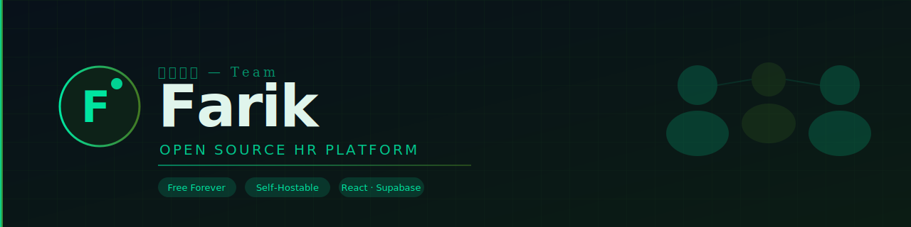

# 🚀 Farik — Open Source HR Platform

<div align="center">




</div>

> **فريق** = Team in Arabic. Free forever, Pro when you're ready.

[](https://farik.vercel.app)
[](LICENSE)
[](https://react.dev)
[](https://farik.vercel.app)
[](https://github.com/SamoTech/Farik)

**Farik** is a modern open-source HRMS built for small and growing teams who are tired of paying $200/month for HR tools that lock your data and never fit your workflow.

🔗 **Live Demo:** [farik.vercel.app](https://farik.vercel.app)  
💻 **GitHub:** [github.com/SamoTech/Farik](https://github.com/SamoTech/Farik)

---

## 🎮 Try It Now — Sign Up Free

Go to [farik.vercel.app](https://farik.vercel.app) and create a free account in seconds.

---

## ✨ Why Farik?

| Problem with legacy HR tools | Farik's answer |
|---|---|
| Costs $150-300/month | Free core, $29/mo Pro |
| Your data on their servers | Self-host, own everything |
| Ugly, slow UI | Dark, modern, fast |
| Attrition always a surprise | AI risk flags per employee (Pro) |
| Burnout goes undetected | Mood Pulse + heatmaps (Pro) |
| Complex setup | Deploy in 5 minutes on Vercel |

---

## 🆓 Free Features (Forever)

- **👥 People Directory** — Employee profiles, skills, performance scores, risk flags
- **📋 Recruitment Pipeline** — Kanban: Screening → Interview → Assessment → Offer
- **🎫 Employee Helpdesk** — Internal ticketing for HR requests
- **📅 Attendance & Leave** — Balances, approvals, remote tracking
- **🔐 Real Authentication** — Sign up / sign in powered by Supabase
- **📊 Dashboard Analytics** — Live metrics from your real data

---

## ⭐ Pro Features ($29/month)

- **💰 Payroll Engine** — Automated runs, pay slips, anomaly detection
- **🧠 AI Analytics** — Attrition prediction, burnout heatmaps, culture scoring
- **😊 Mood Pulse** — AI-inferred team sentiment
- **🔮 Attrition Forecasting** — 90-day flight risk per employee
- **💼 Full Salary Visibility** — Compensation data across the org

---

## 🚀 Deploy Your Own in 5 Minutes

### Option A: Vercel (Recommended — Free)

1. Fork → [github.com/SamoTech/Farik/fork](https://github.com/SamoTech/Farik/fork)
2. Go to [vercel.com](https://vercel.com) → **New Project** → Import your fork
3. Click **Deploy** ✅

### Option B: Run Locally

```bash
git clone https://github.com/SamoTech/Farik.git
cd Farik
npm install
npm start
# Open http://localhost:3000
```

---

## 🗺️ Roadmap

### ✅ v2.0 — Current (Live)
- [x] Real Sign Up / Sign In (Supabase Auth)
- [x] Employee CRUD — real database
- [x] Recruitment pipeline
- [x] Helpdesk ticketing
- [x] Payroll engine (Pro)
- [x] Analytics from live data (Pro)

### 🔧 v2.1 — Coming Soon
- [ ] CSV / PDF export
- [ ] Email notifications
- [ ] Arabic UI option
- [ ] Stripe payments for Pro

### 🔮 v3.0 — Planned
- [ ] Real AI analytics (OpenAI)
- [ ] Multi-company support
- [ ] Mobile app (React Native)
- [ ] Slack / WhatsApp integration

---

## 🤝 Contributing

```bash
git checkout -b feature/your-feature
git commit -m 'Add your feature'
git push origin feature/your-feature
# Open a Pull Request
```

---

## 📄 License

MIT — free to use, modify, and self-host forever.

---

## ⭐ Support the Project

If Farik saved your team money, please **star the repo** ⭐

**Share:**
[🐦 Twitter](https://twitter.com/intent/tweet?text=Check%20out%20Farik%20-%20free%20open-source%20HR%20platform!%20https%3A%2F%2Ffarik.vercel.app) | [💼 LinkedIn](https://www.linkedin.com/sharing/share-offsite/?url=https://farik.vercel.app) | [🤖 Reddit](https://reddit.com/r/opensource)

---

<div align="center">
Built with ❤️ by <a href="https://github.com/SamoTech">SamoTech</a> — Open Source Forever
</div>
